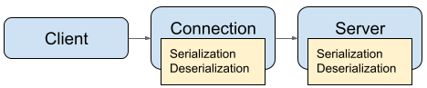
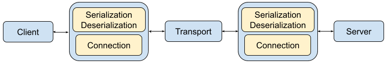
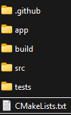
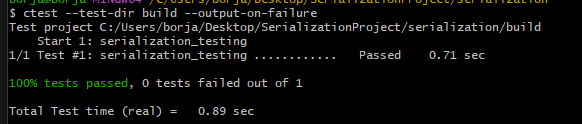
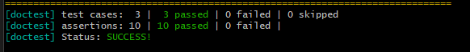
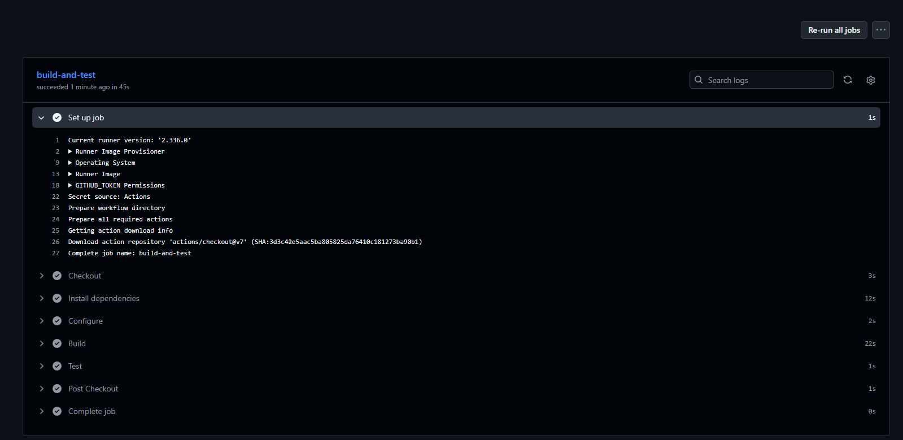
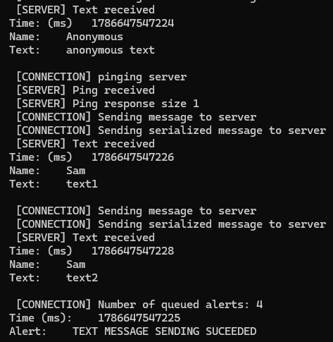

# protobuf_mock_server

## Project description:

The project is a simple non-interactive example of serialization and deserialization of messages using the protobuf library in the context of a mock client-server interaction. The app shows the way the data is moved and transformed by displaying the relevant information in the terminal.

## Motivation:

There were two main learning objectives that inspired this project:
- Learn about some serialization library  in C++
- Larn about CI workflows in Github

## Architecture:


### Network modeling
In the code, There are three main classes to model the network and exchange of data :

- A client, that sends messages to the server, and doesn’t know about serialization or networking
- A “connection” that acts as a messenger that serializes and sends data to the server, receives serialized responses (alerts), and manages queues of messages if sending is not possible.
- A (mock) server, that receives the serialized messages, deserializes them, and produces simple responses (status code + time) that are serialized and send back 

In this model, the client owns a single connection object, and the connection has access to the server . This makes the relationship between client and server  asymmetrical.


#### Simplified client - server network model used in app

<p align="center">
  
</p>

Ideally, serialization and deserialization would be independent from connection and server, and they would happen at both sides of some “Transport” layer, with the possibility of organizing  connection and serialization/deserialization in different ways.


#### More general - server network model 

<p align="center">
  
</p>


## Folder structure and compilation:

<p align="left">
  
</p>


There are two CMakeLists.txt , one at project folder level, and another one in **tests/**. 

The main CMakeLists produces two relevant outputs:
- A library **serialization_core** ,  to be used by both by tests and main app
- The main app **serialization.exe** itself, built from serialization_core , dependencies and main.cpp

The tests/CMakeLists.txt file  uses doctest to generate tests and compile into **serialization_testing.exe** .

The compiled executables will be located in the **app/** directory within the project folder.


## Compiling the app:

Requirements (versions in which the original project was compiled):
- C++ compiler with C++17 support
- CMake 3.20
- Protocol Buffers (protobuf)
- Abseil (absl)

Steps to compile:
- Clone the repository or download the project files.
- The main CMakeLists.txt file has a flag called **SERIALIZATION_EXTRA_ABSL**. Depending on the environment and how protobuf and absl were installed, it may have to be changed from OFF to ON. ( build step later will complain about undefined reference to absl)
- Open the terminal used to compile and change directory to the project directory. Then run the instructions
```
   cmake -S . -B build
   cmake --build build
```


## Results:

Results are split into two parts, **tests** and **app execution**.

The testing and CI succeeded. In order, the following images show the outputs of :
- ctest 
- serialization_testing.exe direct output
- CI workflow

<p align="left">
  
</p>
<p align="left">
  
</p>
<p align="left">
  
</p>


After executing **serialization.exe**, the terminal shows through prints the flow of the data and messages in a simple example. Here is part of its output

<p align="center">
  
</p>


## Limitations :

Due to the objectives and scope of the project, there are many limitations, the most important ones related to networking and the simplified model the app uses. Besides the conceptual simplifications, a real client-server interaction should probably involve async programming.

Queuing and handling of errors and connection issues could also be improved upon.


